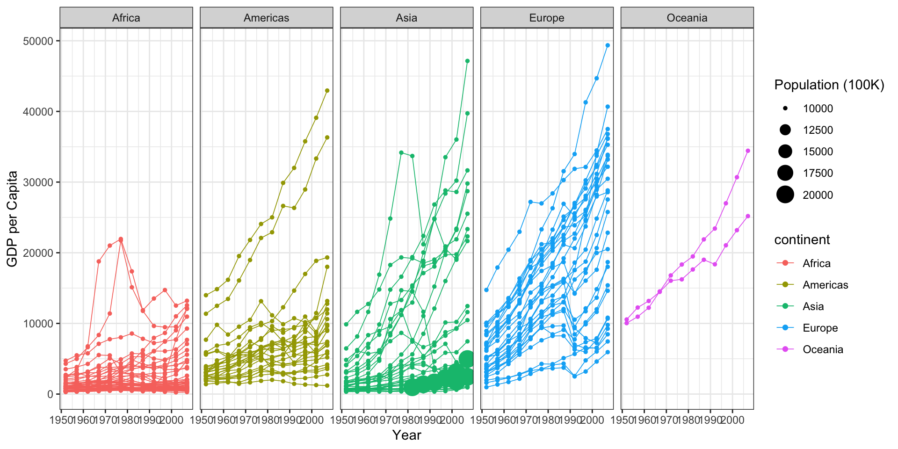

::: {.cell}

```{.r .cell-code}
gapminder1<-gapminder%>%filter(country!="Kuwait")%>%
  mutate(population = case_when(
           pop< 5000000 ~ " 2500",
           pop> 4999999 & pop<7500000 ~ " 5000",
           pop> 7499999 & pop<10000000~ " 7500",
           pop> 9999999 & pop<12500000 ~ "10000",
           pop> 12499999 ~"12500"))  
```
:::

::: {.cell}

```{.r .cell-code}
ggplot(data =gapminder1, mapping = aes(x=lifeExp, y=gdpPercap, 
                                  color = continent,
                                  size = population)) +
geom_point() +
scale_shape_manual(values = 20)+
scale_x_continuous(trans = "sqrt")+
scale_y_continuous(trans = "sqrt") +
scale_color_manual(values =c("red","yellow","green","skyblue","purple"))+
  geom_point(size=1)+
labs(x= "Life Expectancy",
     y = "GDP per Capita",
     size = "Population (100K)",
     color = "continent") + 
  theme_bw() +
facet_wrap(~year, nrow=1)
```

::: {.cell-output-display}
{width=672}
:::
:::

::: {.cell}

:::
